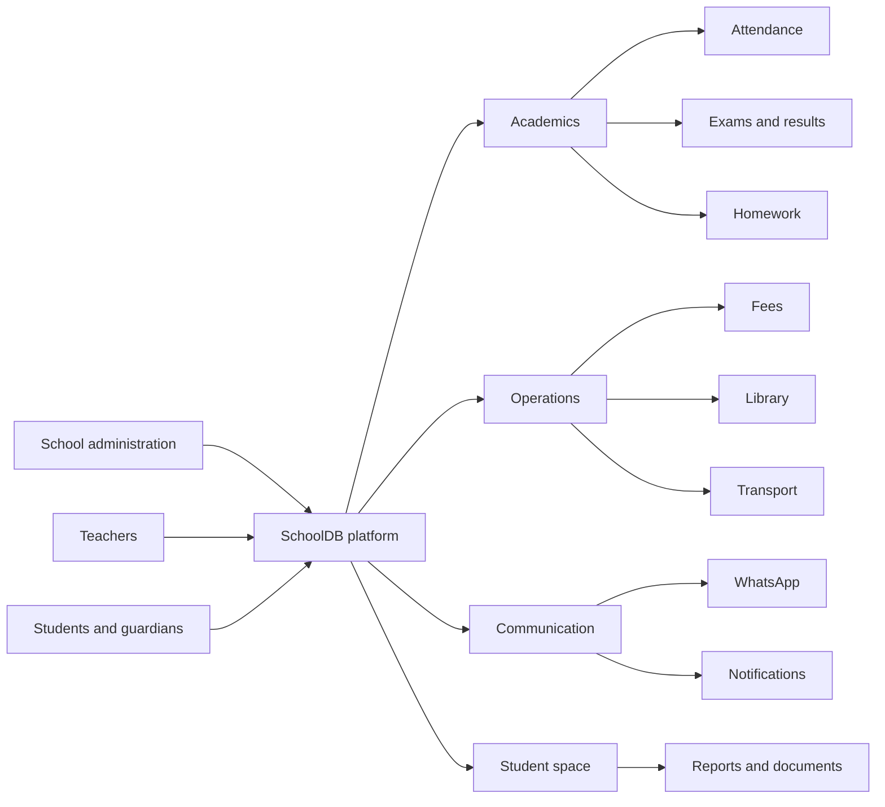
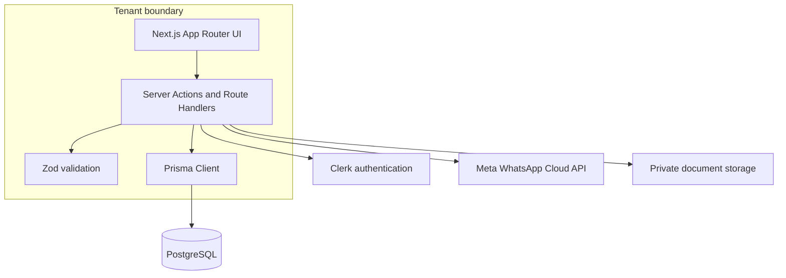
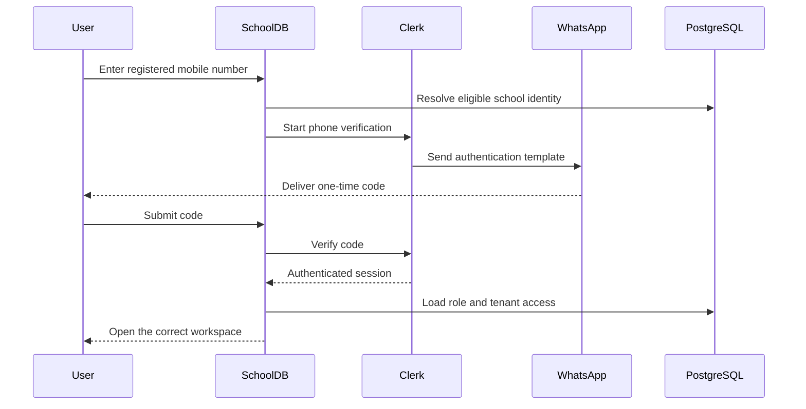

<p align="center"></p>

<h1 align="center">SchoolDB</h1>

<p align="center">
  <strong>A premium, multi-tenant school management platform built for modern institutions.</strong>
</p>

<p align="center">
  
</p>

<p align="center">
  <a href="#quick-start"></a>
  <a href="#platform-modules"></a>
  <a href="#whatsapp-communication"></a>
</p>

<p align="center">
  
  
  
  
  
  
  
</p>

---

## The school operating system

SchoolDB brings administration, academics, communication, and student self-service into one secure workspace. Every school receives its own branded URL and isolated data boundary, while administrators get a consistent experience across daily operations.



## Highlights

- **One platform, many schools** — tenant-aware routes, permissions, branding, and records.
- **Role-based access** — tailored workspaces for super admins, school admins, teachers, staff, and students.
- **Passwordless sign-in** — WhatsApp OTP authentication for registered mobile numbers.
- **Automated communication** — approved Meta templates for announcements, homework, attendance, fees, and results.
- **Student self-service** — direct access to attendance, fees, results, exams, timetable, homework, notices, documents, and leave requests.
- **Print-ready workflows** — customizable ID cards, certificates, receipts, and reports.
- **Operational at scale** — paginated queries, database indexes, validation, rate limits, and queue-friendly message batches.

## Platform modules

| Workspace | Capabilities |
|---|---|
| **Students** | Admissions, enrollment, guardians, health and services, documents, profile images, IDs, EMIS, Aadhaar, APAAR and remarks |
| **Staff & access** | Teachers, principals, administrators, reception staff, Clerk identities and role-aware access |
| **Academics** | Academic years, classes, sections, subjects, class subjects, enrollments and teacher allocations |
| **Attendance** | Daily marking, history, dashboard, class reports, student reports and low-attendance tracking |
| **Fees & finance** | Plans, categories, collection, payments, outstanding balances, receipts, expenses and class/section filters |
| **Timetable** | Periods, daily schedules, class timetables and teacher timetables |
| **Academic work** | Homework, exams, marks, results and report cards |
| **Communication** | In-app notifications, WhatsApp campaigns, delivery status, scheduling and audience targeting |
| **School services** | Library, transport, calendar, leave requests and bulk imports |
| **Documents** | Bonafide and study certificates, student ID cards, exports and print-ready layouts |

## Product experience

The interface follows a clean, responsive workspace model with premium cards, clear data hierarchy, reusable class and section filters, searchable student selectors, confirmation dialogs, and accessible form states.

> Add approved product captures under `docs/screenshots/` when preparing a public showcase. Keep student names, phone numbers, admission numbers, and school credentials anonymized.

| Recommended capture | Suggested file |
|---|---|
| School dashboard | `docs/screenshots/dashboard.png` |
| Student profile | `docs/screenshots/student-profile.png` |
| Attendance workspace | `docs/screenshots/attendance.png` |
| Notifications and WhatsApp | `docs/screenshots/communications.png` |
| ID card designer | `docs/screenshots/id-cards.png` |

## How the platform fits together



## WhatsApp communication

SchoolDB uses the Meta WhatsApp Cloud API for OTP delivery and school communication. Messages outside the customer-service window are sent through approved templates.



Supported message flows include:

- Login OTP
- School announcements
- Attendance alerts
- Homework assignments
- Exam result updates
- Fee reminders

Audience targeting supports the whole school, a class, a class section, or an individual student. Campaigns can be queued, processed in batches, retried, and audited using provider delivery statuses.

## Access model

| Role | Typical access |
|---|---|
| **Super Admin** | Cross-school administration, platform configuration, staff access and all school modules |
| **School Admin / Principal** | Full management access within the assigned school |
| **Teacher** | Allocated classes, attendance, homework, timetable and permitted academic workflows |
| **Operational staff** | Permission-based access for reception, accounts, library, transport and related duties |
| **Student / Guardian** | Read-focused student space for personal academic and school information |

Authorization is enforced on the server. Hiding a navigation item is a convenience, not the security boundary.

## Technology

| Layer | Stack |
|---|---|
| Application | Next.js 16 App Router, React 19, TypeScript |
| UI | Tailwind CSS 4, Radix UI, shadcn-style components, Lucide icons |
| Data | PostgreSQL, Prisma ORM 7 |
| Authentication | Clerk with WhatsApp phone verification |
| Validation | Zod |
| Tables | TanStack Table |
| Messaging | Meta WhatsApp Cloud API |
| Payments | Cashfree hosted checkout and signed webhooks |
| Testing | Node.js test runner and TypeScript strip-types |

## Project structure

```text
schooldb/
├── prisma/                    # Schema and database migrations
├── public/                    # School logos and public assets
├── scripts/                   # Maintenance and load-test utilities
├── src/
│   ├── app/
│   │   ├── [schoolSlug]/      # Tenant-aware admin and student routes
│   │   └── api/               # Webhooks and HTTP endpoints
│   ├── components/            # Reusable UI and feature components
│   └── lib/                   # Auth, data access, messaging and utilities
├── tests/                     # Automated tests
├── .env.example               # Environment variable reference
└── package.json
```

## Quick start

### Prerequisites

- Node.js 20 or newer
- npm
- PostgreSQL
- A Clerk application
- A Meta WhatsApp Business account for OTP and message delivery
- A Cashfree Payments account for online fee collection

### 1. Clone and install

```bash
git clone https://github.com/harikiran-dev-schooldb/schooldb-v2.git
cd schooldb-v2
npm install
```

### 2. Configure the environment

```bash
cp .env.example .env.local
```

Complete the values in `.env.local`. Never commit production secrets, database credentials, Clerk keys, Meta access tokens, or webhook secrets.

### 3. Prepare the database

```bash
npx prisma generate
npx prisma migrate dev
```

If Prisma reports that a migration directory has no `migration.sql`, restore that file from version control or remove only the confirmed incomplete migration directory before retrying.

### 4. Start SchoolDB

```bash
npm run dev
```

Open [http://localhost:3000](http://localhost:3000). A tenant is accessed through its school slug, for example `/kotak-vsp`.

## Cashfree online fee payments

Add the Cashfree credentials to `.env` and keep `CASHFREE_ENV=sandbox` while testing. Parents and students can select outstanding installments from their Fees page. Admins and Super Admins can also generate a QR from Fee Collection for a student to scan. The payable amount is always recalculated on the server.

Configure this webhook in Cashfree:

```text
https://YOUR-DOMAIN/api/v1/public/payments/cashfree/webhook
```

For production, set `NEXT_PUBLIC_BASE_URL` to the public HTTPS origin, whitelist that domain in Cashfree, complete a sandbox payment and webhook test, and only then change `CASHFREE_ENV=production`. Localhost return-page testing works without a public URL, but webhook delivery requires a public HTTPS tunnel or deployed preview.

## Environment configuration

The complete reference lives in [`.env.example`](.env.example). Configuration is grouped into:

- PostgreSQL connection and pool limits
- Private file storage
- Clerk authentication
- Meta WhatsApp Cloud API credentials and template names
- OTP expiry, resend, attempt, and rate limits
- WhatsApp automation and webhook verification
- Load-test controls

## Available commands

| Command | Purpose |
|---|---|
| `npm run dev` | Start the local development server |
| `npm run build` | Generate Prisma Client and create a production build |
| `npm run start` | Run the production server |
| `npm run lint` | Check code quality |
| `npm test` | Run the automated test suite |
| `npm run load:test` | Run the configured load test |
| `npx prisma studio` | Inspect local database records visually |
| `npx prisma migrate dev` | Create and apply a development migration |

## WhatsApp setup checklist

1. Create or connect a Meta WhatsApp Business account.
2. Add the phone number ID, business account ID, permanent access token, and app secret.
3. Create and approve the authentication and utility templates referenced in `.env.example`.
4. Configure the webhook URL and matching verification token.
5. Enable automation only after the templates show an active status.
6. Verify delivery with one test student before sending to a class or the whole school.

Template names currently supported by configuration include OTP login, school announcements, attendance, homework, results, and fees.

## Quality and performance

Before opening a pull request or deploying:

```bash
npm run lint
npm test
npm run build
```

Performance-sensitive pages should keep tenant filters inside database queries, select only required fields, paginate large collections, avoid per-row queries, and preserve the schema indexes used by attendance, fee, enrollment, and messaging workflows.

## Security principles

- Resolve the authenticated identity and school membership on the server.
- Scope every protected query and mutation to the active school.
- Validate inputs before database or provider calls.
- Keep documents private and issue access only through authorized routes.
- Verify WhatsApp webhook signatures before accepting provider events.
- Rate-limit OTP requests and verification attempts.
- Avoid logging OTPs, access tokens, private student data, or full mobile numbers.
- Treat Aadhaar, health information, guardian contacts, and student documents as sensitive data.

## Production readiness

- [ ] Production database is provisioned, backed up, and connection limits are configured
- [ ] All migrations are committed and successfully applied
- [ ] Clerk production keys and allowed origins are configured
- [ ] WhatsApp templates are approved and webhook delivery is verified
- [ ] Cron or queue processing uses a strong secret
- [ ] Private uploads use durable storage with authorization checks
- [ ] Monitoring, error reporting, and audit retention are enabled
- [ ] Rate limits and load-test targets match the selected hosting plan
- [ ] School branding, certificate text, signatures, and print layouts are approved
- [ ] Test accounts and sample student data are removed

## Roadmap

- Native Android student and staff application
- Push notifications alongside WhatsApp and in-app notices
- Configurable approval workflows and granular permission sets
- Expanded analytics for attendance, fees, academic performance, library, and transport
- Additional exports and regulator-ready reporting
- Offline-friendly teacher attendance and homework workflows

## Contributing

1. Create a focused branch.
2. Keep changes tenant-safe and role-aware.
3. Add or update tests for behavioral changes.
4. Run lint, tests, and the production build.
5. Submit a clear pull request with screenshots for interface changes.

## License

No open-source license is currently published for this repository. Treat the source code and product assets as proprietary unless the repository owner provides written permission.

---

<p align="center">
  
</p>

<p align="center">
  <strong>SchoolDB</strong><br />
  Built to keep every school day connected.
</p>
