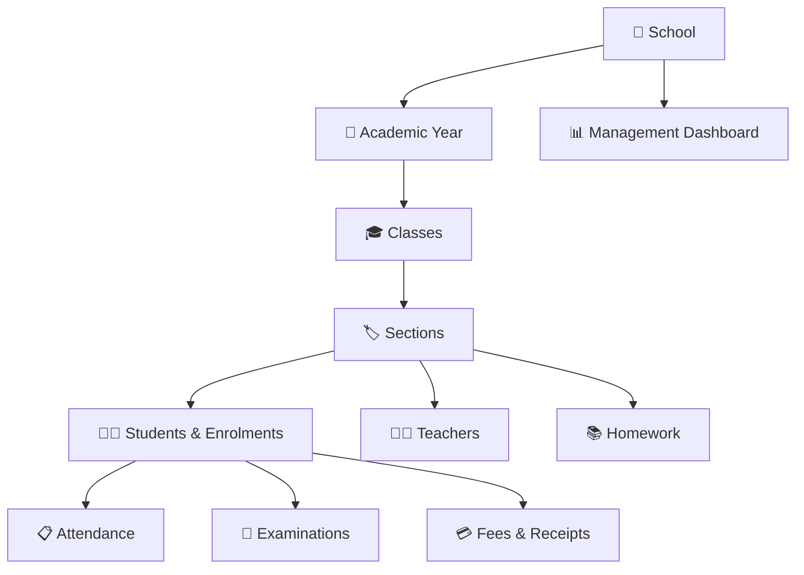

<div align="center">

# 🏫 SchoolDB

### **The operating system for modern school administration.**

A premium, structured school management platform for bringing everyday academic and administrative operations into one connected workspace.

<br />

[](https://nextjs.org/)
[](https://react.dev/)
[](https://www.typescriptlang.org/)
[](https://www.prisma.io/)
[](https://www.postgresql.org/)

<br />

**School Management · Students · Academics · Attendance · Exams · Fees · Homework**

</div>

---

## ✦ Why SchoolDB?

Schools often manage critical information across spreadsheets, registers, separate tools and disconnected workflows.

**SchoolDB brings the core operating structure together.**

> **One school. One structured system. One clearer way to operate.**

Designed around the way a school is actually organised — academic years, classes, sections, students, teachers and daily operations — SchoolDB provides a consistent foundation for school administration.

---

## ✦ Product at a Glance

| Area | What SchoolDB provides |
| :--- | :--- |
| 🎓 **Academic Management** | Academic years, classes, sections and school structure |
| 👨‍🎓 **Student Management** | Student records, admissions, enrolment and academic information |
| 👩‍🏫 **Teacher Management** | Centralised teacher records and organisation |
| 📋 **Attendance** | Day-to-day attendance workflows and visibility |
| 📝 **Examinations** | Exam management and exam-specific workflows |
| 💳 **Fees** | Fee tracking, collections and outstanding visibility |
| 🧾 **Fee Receipts** | Structured receipt workflows |
| 📚 **Homework** | Organise academic homework and tasks |
| ⚡ **Bulk Operations** | Efficient handling of larger school datasets |
| 📊 **Dashboard** | Operational overview for school management |

---

## ✦ Built Around the School



The platform follows the school's organisational hierarchy instead of treating each feature as an isolated tool.

---

## ✦ Core Experience

### 📊 Management Dashboard

A management-focused operational view bringing important school information into one place.

**Designed to answer:**

- How many students are in the school?
- How is attendance performing?
- What fee activity needs attention?
- What operational items require follow-up?

### 👨‍🎓 Students & Enrolments

A structured student area for managing records, admissions, enrolment details and academic information.

### 🎓 Academic Structure

Build the foundation first:

**Academic Year → Classes → Sections → Subjects → Students**

This gives downstream school workflows a consistent structure.

### 📋 Attendance

Manage attendance within the same academic and student context, with visibility into attendance performance and follow-up areas.

### 📝 Examinations

Keep examination workflows inside the same school environment and connected to the academic structure.

### 💳 Fees & Receipts

Track fee activity and maintain receipt workflows alongside student and enrolment information.

### 📚 Homework

Keep academic homework activity organised within the school's operating environment.

### ⚡ Bulk Operations

Support administrative teams working with larger volumes of school data through dedicated bulk-operation workflows.

---

## ✦ Multi-School Architecture

SchoolDB is designed around **school-specific workspaces**.

```text
SchoolDB
   │
   ├── School A
   │     ├── Users & Roles
   │     ├── Academic Structure
   │     ├── Students
   │     ├── Teachers
   │     └── Operations
   │
   ├── School B
   │     ├── Users & Roles
   │     ├── Academic Structure
   │     ├── Students
   │     ├── Teachers
   │     └── Operations
   │
   └── School C
         └── ...
```

The application uses school-specific routing and membership-aware access to keep each school's operating environment separated.

---

## ✦ Product Areas

```text
School Setup
    ↓
Academic Year
    ↓
Classes & Sections
    ↓
Students & Enrolments
    ↓
Teachers
    ↓
Attendance ─── Examinations ─── Fees ─── Homework
    ↓
Management Dashboard
```

This flow is the heart of the SchoolDB experience.

---

## ✦ Technology

SchoolDB is built as a modern full-stack web application.

| Layer | Technology |
| :--- | :--- |
| **Framework** | Next.js 16 · App Router |
| **UI** | React 19 |
| **Language** | TypeScript 5 |
| **Authentication** | Clerk |
| **ORM** | Prisma 7 |
| **Database** | PostgreSQL |
| **UI Components** | shadcn/ui · Radix UI |
| **Forms & Validation** | React Hook Form · Zod |
| **Tables** | TanStack Table |
| **Icons** | Lucide React |
| **Styling** | Tailwind CSS 4 |

---

## ✦ Local Development

### Requirements

- Node.js
- PostgreSQL
- Clerk application credentials
- Environment variables configured for the application

### Install

```bash
npm install
```

### Run development server

```bash
npm run dev
```

Open:

```text
http://localhost:3000
```

### Lint

```bash
npm run lint
```

### Production build

```bash
npm run build
```

### Production start

```bash
npm run start
```

---

## ✦ Project Structure

```text
src/
├── app/
│   ├── [schoolSlug]/
│   │   ├── login/
│   │   └── (app)/
│   │       ├── dashboard/
│   │       ├── academic-year/
│   │       ├── classes/
│   │       ├── sections/
│   │       ├── students/
│   │       ├── teachers/
│   │       ├── attendance/
│   │       ├── exams/
│   │       ├── fees/
│   │       ├── fee-receipts/
│   │       ├── homework/
│   │       ├── periods/
│   │       └── bulk-operations/
│   ├── api/
│   ├── onboarding/
│   ├── register/
│   └── login/
│
├── components/
├── contexts/
├── features/
└── lib/
```

---

## ✦ Product Philosophy

### **Structure first. Operations second. Insights always.**

SchoolDB is built around three principles:

**01 — Structure**  
Model the school correctly before operating it.

**02 — Simplicity**  
Give staff focused workflows for the work they actually perform.

**03 — Visibility**  
Give management a clearer view of what is happening across the school.

---

## ✦ For Schools

SchoolDB is intended for schools looking to modernise administrative operations without turning everyday school work into a complicated technology project.

### The promise

> **Less scattered information.**  
> **Less repetitive administration.**  
> **More operational clarity.**

---

## ✦ Demo & Marketing

The repository includes a dedicated internal sales kit for demonstrating SchoolDB to schools:

📁 [`docs/marketing/SCHOOLDB-SALES-KIT.md`](docs/marketing/SCHOOLDB-SALES-KIT.md)

It contains:

- Product positioning
- Demo flow
- 3–5 minute demo script
- Core sales messages
- WhatsApp/flyer copy
- Objection handling
- Sales rules
- Recommended marketing assets

---

## ✦ Current Product Scope

SchoolDB's marketing materials should describe **verified product capabilities only**. Roadmap concepts should not be presented as currently available functionality.

This README intentionally focuses on the product areas represented in the current application rather than promising future modules.

---

## ✦ Repository

<div align="center">

**SchoolDB — modern school operations, structured beautifully.**

[View the Repository](https://github.com/harikiran-dev-schooldb/schooldb-v2)

</div>

---

<div align="center">

### Built for schools. Designed for clarity. 🚀

</div>
